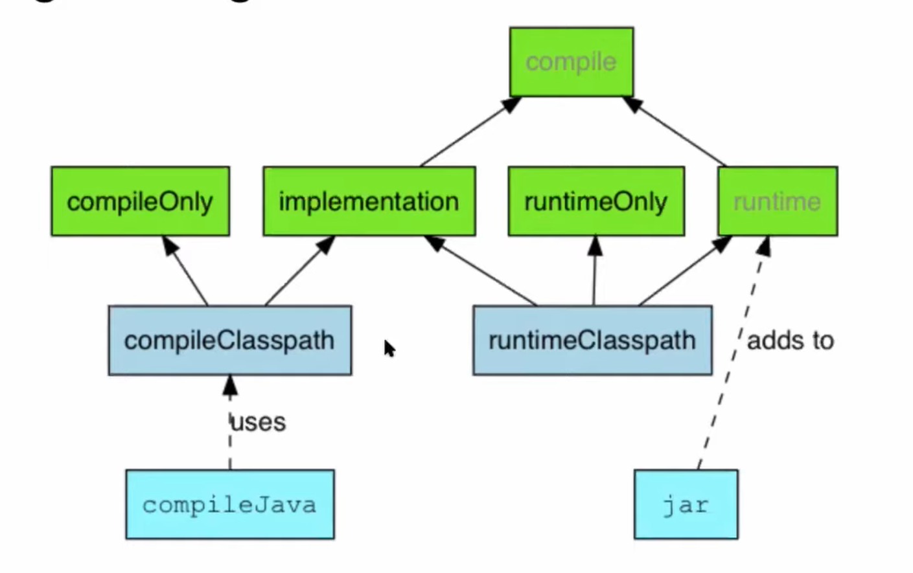

# React JS

## Создать проект

```
$ npx create-react-app test-project-name
...
Success! Created test-app at /Users/user/JsProjects/test-app
Inside that directory, you can run several commands:

    yarn start
      Starts the development server.
  
    yarn build
      Bundles the app into static files for production.
  
    yarn test
      Starts the test runner.
  
    yarn eject
      Removes this tool and copies build dependencies, configuration files
      and scripts into the app directory. If you do this, you can’t go back!
  
We suggest that you begin by typing:

  cd test-project-name
  yarn start
  
$ cd test-project-name
$ yarn start (or npm start)
```

## Структура проекта

```
node_modules — зависимости
public/index.html — главный html документ (по сути ввсе приложение отрисовывается в компонент с id=root)
package.json — описание зависимостей
index.js — по сути главный исполняемый файл, который отрисовывает компонент App и кладет в root
App.js — внутри видим html-подобный код — это JSX.

Так же в index.js видим в узле scripts команды объяленные: запуск приложения (можно и через yarn) 
npm start
```

## Разработка

У React компонентный подход: то есть создаем отдельные компоненты, а потом их комбинируем

## Интересные пакеты

React Flow — построение графов — [https://reactflow.dev/](https://reactflow.dev)

## Security

### XSS

В ReactJS встроена защита, от разного рода XSS инъекций (auto escaping):

```jsx
import './App.css';

function App() {
  let XSS_PAYLOAD = "";

  return (
    <div className="App">
      <header className="App-header">
        <div>STRING {XSS_PAYLOAD} ESCAPED</div>
      </header>
    </div>
  );
}

export default App;
```

И выглядит это так:



Однако, для разработчиков оставили способ отрисовать html+js в динамике, если это действительно необходимо:

```javascript
function createMarkup() {
  return {__html: 'First &middot; Second'};
}

function MyComponent() {
  return <div dangerouslySetInnerHTML={createMarkup()} />;
}
```

### Incorrect work with location

Ищем по коду работу с `window.location`. Здесь могут быть и не так обработанные параметры, и Open Redirect и CSRF и тп.
